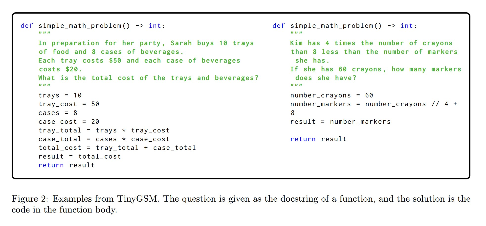
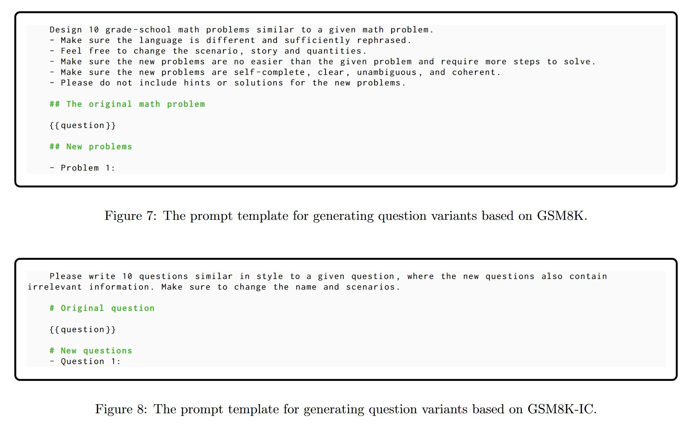
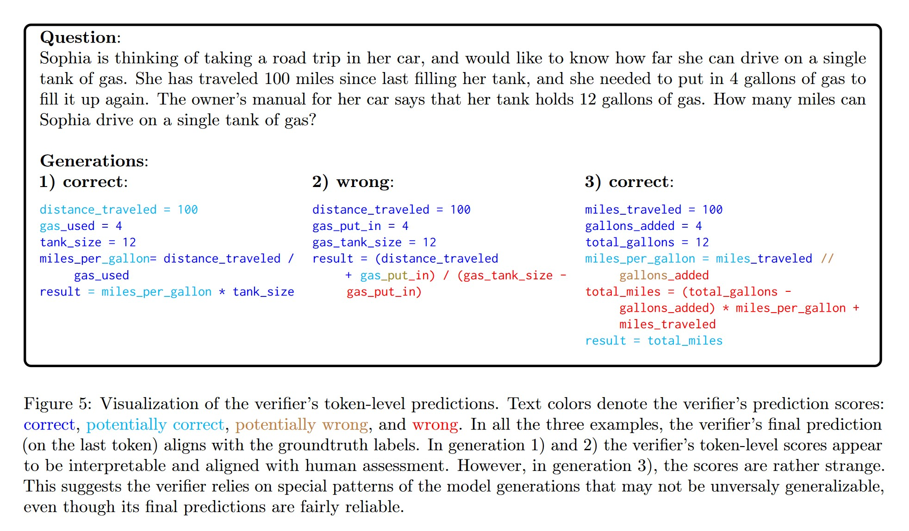

- https://huggingface.co/datasets/TinyGSM/TinyGSM
- https://arxiv.org/pdf/2312.09241

To our surprise, in the case of GSM8K, we are able to bridge the performance gap between the student and teacher, 
by utilizing a tiny amount of labeled real data (the original GSM8K training set of 7k questions) to `train an
independent verifier model`. At test time, the verifier score and select among multiple candidate answers generated
from the student, and then we output the highest score generation as the final submission.

Note the idea of usin a verifier is proposed by the seminal GSM8K paper https://arxiv.org/pdf/2110.14168

We introduce TinyGSM, a synthetic dataset containing GSM8K-style math word problems paired with Python
solutions, generated fully by GPT-3.5-turbo. TinyGSM consists of 12.3M questions which amount to 1.8B tokens.
We demonstrate TinyGSM’s high-quality by `finetuning the Phi-1.5 1.3B model` (before the use of verifiers) which
improves its accuracy `from 44.6% to 68.2%` on the GSM8K test set. Notably, our `smallest 125M model can also
achieve 63.1% after finetuning on TinyGSM`.

When integrated with a verifier for scoring generations, 1.3B model achieves 81.5% accuracy, significantly outperforming
existing open-source models and even rivaling the 77.4% accuracy of GPT-3.5, from which TinyGSM is generated.

- - -

TinyGSM: augmenting GSM8K with synthetic generations Despite the high quality, the GSM8K training set
only contains 7473 problems, which is too small for training a reasonably sized language mode.

We prompt GPT-3.5-turbo to generate problem variants similar to a given question (but not the solution) randomly
sampled from the GSM8K training set. Each problem variant contains both a question and the corresponding solution
written in Python, as shown in Figure 2.1 Using code allows us to leverage a Python interpreter, circumventing
language models’ known limitation regarding numerical calculations and code execution

To enhance robustness, we also generated synthetic problems whose questions contain `irrelevant information`. This
is achieved by augmenting the GSM-IC dataset (Shi et al., 2023a), which is an augmentation of GSM8K specifically
designed to introduce irrelevant context (IC) to the question statement. These GSM-IC variants constitute to
approximately `one third` of TinyGSM.

The resulting synthetic dataset contains 12.3M problems (i.e. question-solution pairs) 2 with, based on the
original 7.4k training set questions and their IC variants. For each question in the GSM8K train set, the prompt
based on this question is shared across API calls, and the source of randomness comes entirely from the generation
process. To encourage diversity, we use `temperature sampling` and `specify in the prompt` to encourage the problem
variants to be `grammatically diverse` and `contain multiple steps`; the exact prompts are provided in Figure 3 and
in Appendix A.1.

Filtering To ensure the quality of the synthetic data in TinyGSM, we filter out problems that are too short or
do not contain numbers, as well as code solutions which are not executable. . Note that we `do not check for the
correctness` of the question or the generated solutions, since the “ground truth” solution is not available.

Given the effectiveness of self-consistency (Wang et al., 2022), one might want to filter the problems by keeping 
the ones which have majority vote only. We did not adopt this strategy since we find that `GPT-3.5-turbo’s generations
are only consistent on easy problems`, hence such consistency filtering will remove challenging problems, 
resulting in a dataset that is too easy to be useful.

“Easy” problems refer to the ones for which a 350M model, trained on a part of TinyGSM, already produces same 
final answer as GPT-3.5-turbo.

For example, for an early version of our 350M model, the model only achieves around 50% on the GSM8K test set, but
can achieve more than 87% on synthetic questions with consistent answers. In other words, adding more easy problems
like these will not help our 350M model bridge the performance gap between itself and GPT-3.5-turbo.

- - -

We finetune the Phi-1.5 125M, 350M and 1.3B models on our TinyGSM from Section 3, and in particular, the 1.3B
model reaches 68.2% accuracy. We use the Adam optimizer with FP16 during training, with a linear warm-up
and a maximum learning rate of 1e-4, a weight decay of 0.01, and an effective `batch size of 1024`. The finetuning
phase takes up to 20k steps in total.

=> Tại sao ko pre-train từ đầu mà lại finetune từ Phi?

Nhận thấy best-of-n generation cho kết quả tốt, nên huấn luyện verifier để bọn best-of-n.

## Discussions

In this work, we showed a simple approach that enabled a 1.3B generation model to achieve 81.5% on the GSM8K
dataset, setting a new state-of-the-art for small language models and raising the performance curve for scaling. Our
approach consists of two simple steps: 1) collecting TinyGSM, a GPT-3.5 generated synthetic dataset which we
will fully release, and 2) using a verifier that scores how likely a generation is correct, whose quality is boosted by
utilizing diverse generations. Our results provide positive evidence that small language models have more potentials
to be unlock and can be used for efficient. For future directions,

• **Leveraging different formats**: TinyGSM uses Python code as solutions, inspired by the observation that language
models tend to struggle at calculations. However, we found that different solution formats, i.e. code versus natural
language, can be complementary: `while code helps circumvent errors related to execution or calculation, it tends
to perform worse at questions that require equation solving`, likely due to the fact that the Python syntax does not
naturally support equations. Properly combining both formats has the potential to further boost performance.

• **The effect of verifier size**: Our results show that given a budget on the model size, scaling the verifier may
be a more efficient use of the parameters. This counters our intuition that verification is an easier task than
generation (which involves search), though there might be connections to findings in GAN training where the size
of discriminator (Arora et al., 2018). Exploring the parameter efficiency in a generation model versus a verifier is
an interesting future direction.

