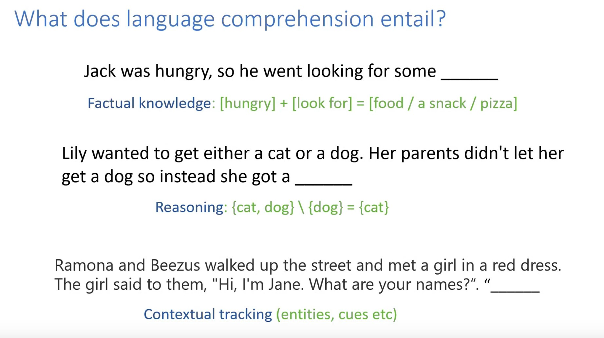
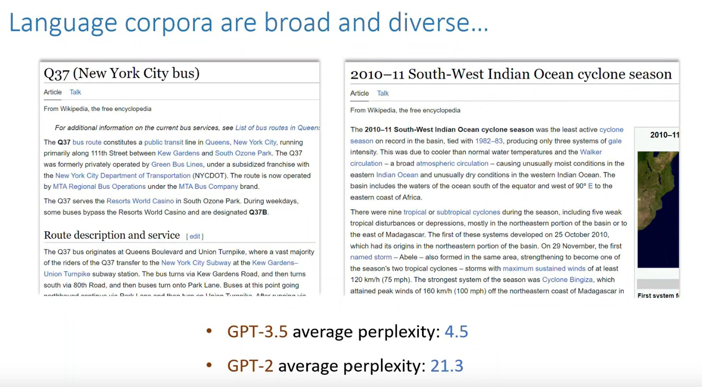
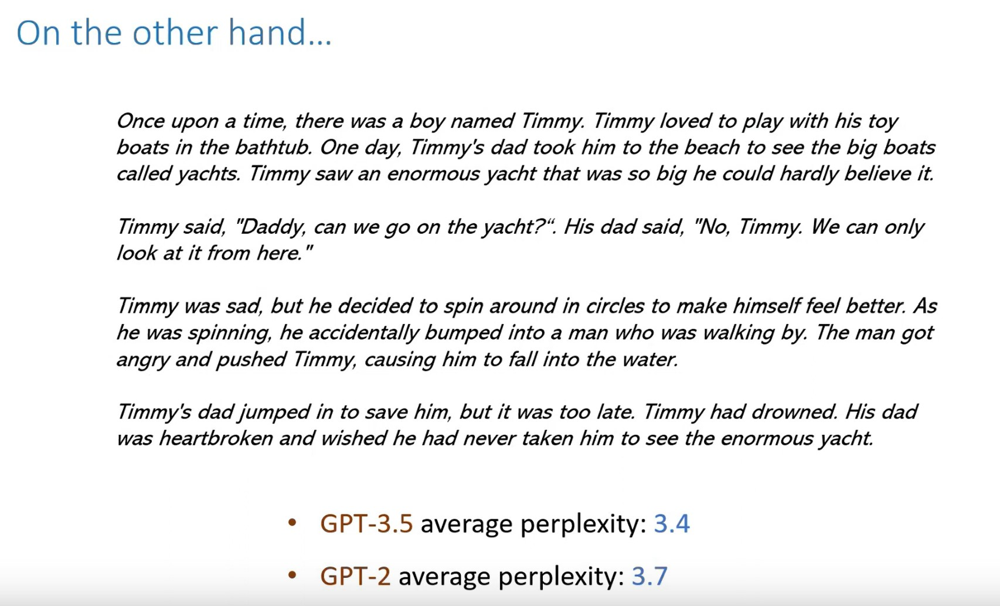
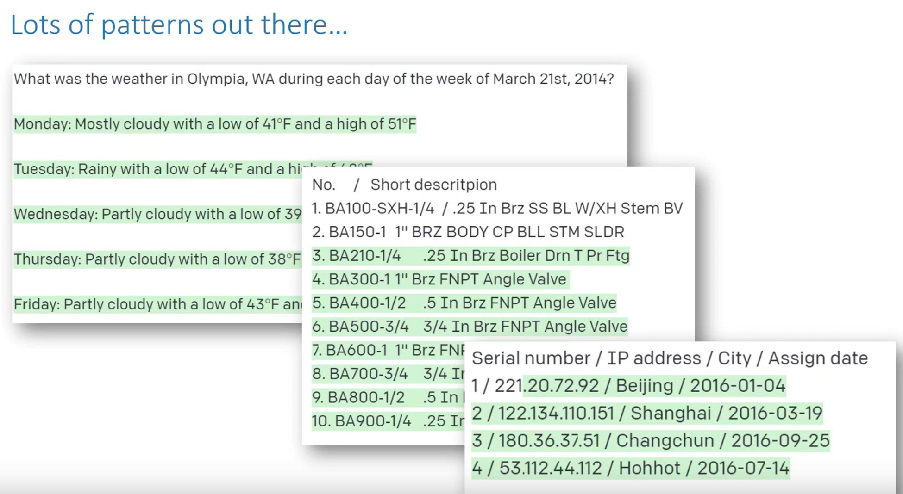
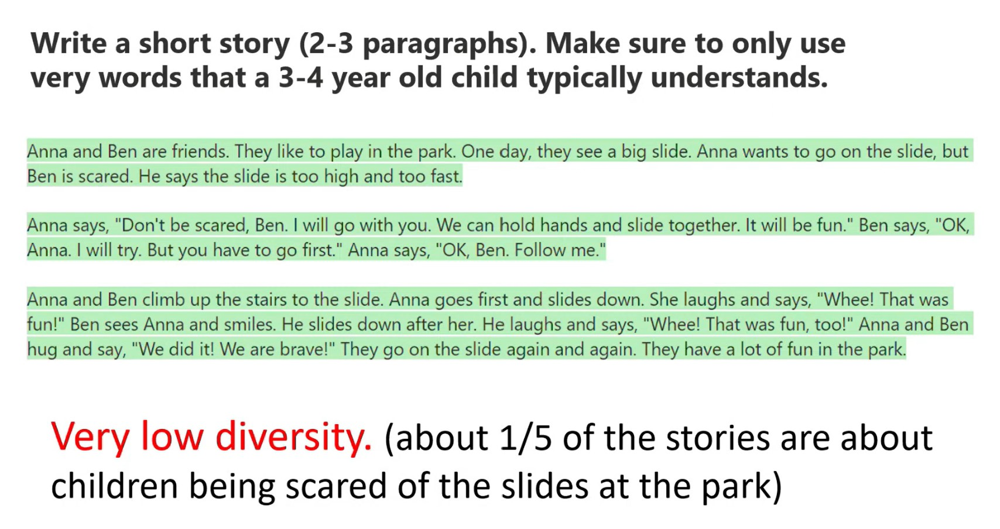
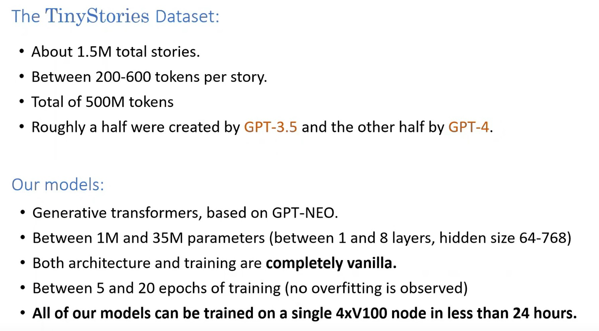
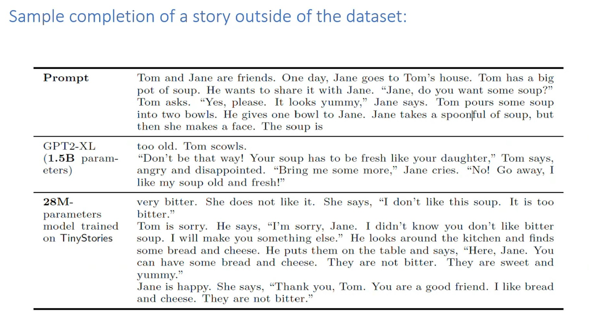
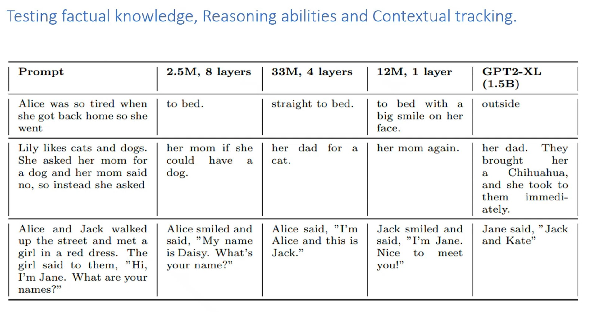

## 18 tháng trước tinystories đã có những insights rất tốt về cách tạo data và huấn luyện models
- https://www.youtube.com/watch?v=iNhrW0Nt7zs
- https://arxiv.org/abs/2305.07759
- https://huggingface.co/datasets/roneneldan/TinyStories
- https://huggingface.co/datasets/roneneldan/TinyStoriesInstruct
- https://huggingface.co/datasets/nampdn-ai/tinystories-vietnamese

- https://huggingface.co/datasets/TinyGSM/TinyGSM
- https://arxiv.org/pdf/2312.09241

## What does it mean to understand language? what does it take to speak fluent English?
- vocab
- grammar
- không cần reasoning?

Không thể tách facts khỏi language vì rất nhiều facts là cần thiết để hiểu ngôn ngữ **và tương tự với reasoning**.

Để sử dụng ngôn ngữ thành cần phải:
- hiểu facts,
- cần kỹ năng reasoning nhất định
- cần có mối liên hệ với ngữ cảnh (follow entities, relationships ...)

- - -

> Hãy nhìn vào một bài viết bất kỳ, dùng ngón tay che đi 1 từ và hãy thử nghĩ xem mình cần dùng **skills** gì để đoán được từ tiếp theo?

Với bài viết khó, với nhiệm vụ đoán từ tiếp theo, gpt-3.5 chỉ cố gắng đoán 4.5 lần, gpt-2 cần hơn 21 lần đoán.
Việc này khó vì nó cần sự am hiểu về nội dung / bối cảnh bài viết (ở đây là Newyork)

Cũng tác vụ đoán từ nhưng với nội dung đơn giản hơn, ta thấy GPT-2 tốt hơn hẳn và gần = gpt-3.5.
Điều này chứng tỏ gpt-2 đã master dạng nội dung này. Và model lớn hơn như GPT-3.5 là không cần thiết.

Model phải học rất nhiều patterns từ data. Có patterns hữu ích, có patterns không.

Data từ Internet rất phức tạp. Liệu với một kỹ năng như ngôn ngữ ta có thể thiết kế một bộ data
nhỏ hơn nhiều nhưng vẫn có các thành phần cơ bản của ngôn ngữ tự nhiên như grammar, vocab, fact và reasoning?

Nhỏ nhưng tập trung hơn!

28M make senses hơn 1.5B (vì được đào tạo trên dữ liệu "tốt" hơn)

ví dụ Alice, 33m thể hiện được tích cấp bách của tình huống (so tired => traight to bed), 1.5b outof context

Ví dụ Lily, 2.5m không thể reasoning, lặp lại dog vì nó xuất hiện nhiều trong prompt (context), 33m thể hiện được. Again, 1.5b don't get it.

Ví dụ Alice & Jact, 2.5m is dumb, 33m hiểu ngữ cảnh và trả lời đúng, 1.5b don't get it.

